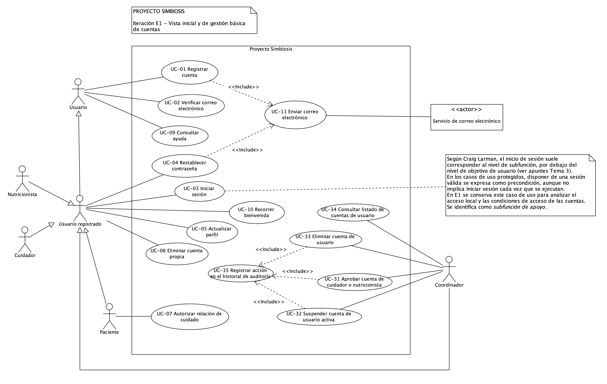

# Modelo de casos de uso de Proyecto Simbiosis

| Versión | Fecha | Estado |
| --- | --- | --- |
| 1.5 | 07/10/2026 | Revisado |

**Iteración de referencia:** E1. Este documento recoge la primera vista revisada del modelo. Será el punto de partida para ampliarlo en E2.

**Plantilla base:** [Plantilla del modelo de casos de uso](plantilla-modelo-casos-de-uso.md). La plantilla se conserva sin cumplimentar. Los resultados del proyecto se incorporan a este documento.

Los diagramas representan distintas vistas del mismo modelo. Los nombres de los actores y los identificadores de los casos de uso se mantienen entre iteraciones.

## 1 Alcance del modelo

La vista de E1 representa el acceso local, la gestión básica de cuentas y la ayuda seleccionada en el apartado 4 del [plan de E1](../planificacion/plan-iteracion-e1.md). Cubre parte de UR-01, UR-02, UR-03, UR-12 y UR-13.

Incluye el registro local y sus condiciones por perfil, la verificación del correo, el inicio de sesión y el restablecimiento de la contraseña. Incluye también la actualización del perfil, la eliminación de la cuenta propia, la autorización de una relación de cuidado, la gestión básica de cuentas por el coordinador, la ayuda contextual y la bienvenida.

La gestión básica de cuentas se representa mediante cuatro objetivos del coordinador: aprobar cuentas de cuidador y nutricionista, suspender cuentas, eliminar cuentas y consultar el listado de cuentas. Las operaciones de aprobación, suspensión y eliminación incluyen el registro de la acción en el historial de auditoría.

La verificación del correo, la aprobación de una cuenta por el coordinador y la autorización de una relación de cuidado son condiciones distintas. Verificar el correo no sustituye las otras dos condiciones.

El modelo no completa los módulos de Gestión de usuarios y Guía interactiva. Quedan pendientes las siguientes funciones:

- El registro, el acceso y la vinculación con Google.
- El uso del alias en los espacios públicos. E1 establece el alias durante el registro.
- La ayuda sobre las funciones todavía no representadas, el progreso entre sesiones, la multimedia y la búsqueda de temas.
- El bloqueo temporal y la expulsión por infracciones.
- El fin de las relaciones de cuidado y la gestión automática de cuentas de cuidador sin pacientes.
- Las funciones de salud, recetas, foro, publicaciones y moderación de contenidos.

Los aplazamientos conservan los requisitos del proyecto. El modelo recoge las funciones seleccionadas para el trabajo de requisitos de E1, aunque algunas queden fuera de su prototipo.

## 2 Actores

Un actor representa un rol externo que interactúa con Proyecto Simbiosis. Una misma persona puede desempeñar más de un rol.

| Nombre del actor | Rol que representa |
| --- | --- |
| Usuario | Persona que interactúa con la plataforma. Este rol general permite representar funciones que no exigen una sesión iniciada. |
| Usuario registrado | Persona que tiene una cuenta. La existencia de la cuenta no implica que haya iniciado sesión. |
| Paciente | Usuario registrado que puede autorizar una relación de cuidado solicitada para él. |
| Cuidador | Usuario registrado que solicita o mantiene relaciones de cuidado con pacientes. |
| Nutricionista | Usuario registrado con perfil profesional sujeto a la aprobación de su documentación. |
| Coordinador | Usuario registrado que consulta el listado de cuentas y aprueba, suspende o elimina cuentas dentro de sus permisos. |
| Servicio de correo electrónico | Sistema externo que presta el servicio de envío de mensajes de verificación y restablecimiento. |

**Generalizaciones.** Usuario registrado especializa a Usuario. Paciente, Cuidador, Nutricionista y Coordinador especializan a Usuario registrado. Cada actor especializado hereda la participación del actor general en sus casos de uso.

Usuario registrado se representa como actor abstracto para agrupar las funciones comunes de los perfiles. La generalización expresa roles, no una secuencia de registro o de inicio de sesión. Paciente y Cuidador no son roles excluyentes: FR-212 permite que una cuenta tenga ambos perfiles.

Cuidador y Nutricionista no tienen asociaciones exclusivas en esta vista. Participan mediante las funciones heredadas. Las condiciones de solicitud de esos perfiles se estudian dentro del registro. El Servicio de correo electrónico es un actor de apoyo y no pertenece a la jerarquía de usuarios.

El registro de auditoría forma parte del comportamiento del sistema. No requiere un actor adicional ni una interacción directa del Coordinador con UC-35.

## 3 Casos de uso

Los objetivos de esta tabla son resúmenes. Las descripciones detalladas quedan pendientes en el apartado 6.

| Identificador | Nombre | Objetivo | Participantes |
| --- | --- | --- | --- |
| UC-01 | Registrar cuenta | Solicitar una cuenta local con los datos y las condiciones del perfil elegido. | Principal: Usuario. Apoyo: Servicio de correo electrónico, mediante UC-11. |
| UC-02 | Verificar correo electrónico | Confirmar la dirección de correo como condición para completar el registro. | Principal: Usuario. |
| UC-03 | Iniciar sesión | Establecer una sesión mediante las credenciales de una cuenta cuyo estado permita el acceso. | Principal: Usuario registrado. |
| UC-04 | Restablecer contraseña | Recuperar el acceso mediante un enlace enviado al correo de la cuenta. | Principal: Usuario registrado. Apoyo: Servicio de correo electrónico, mediante UC-11. |
| UC-05 | Actualizar perfil | Modificar los datos personales y las preferencias de la cuenta propia. | Principal: Usuario registrado. |
| UC-06 | Eliminar cuenta propia | Eliminar la cuenta propia tras comprobar la identidad con la contraseña actual. | Principal: Usuario registrado. |
| UC-07 | Autorizar relación de cuidado | Dar autorización expresa para activar una relación de cuidado concreta. | Principal: Paciente. |
| UC-09 | Consultar ayuda | Consultar las instrucciones y los temas de ayuda de las funciones seleccionadas. | Principal: Usuario. |
| UC-10 | Recorrer bienvenida | Conocer las funciones básicas mediante el recorrido del primer acceso, con la posibilidad de omitirlo. | Principal: Usuario registrado. |
| UC-11 | Enviar correo electrónico | Enviar el mensaje que necesita el caso de uso que lo incluye. | Apoyo: Servicio de correo electrónico. No se asigna un actor principal independiente. |
| UC-31 | Aprobar cuenta de cuidador o nutricionista | Aprobar una cuenta solicitada con perfil de cuidador o nutricionista, conforme a las condiciones del perfil. | Principal: Coordinador. |
| UC-32 | Suspender cuenta de usuario activa | Suspender una cuenta de usuario que se encuentra activa. | Principal: Coordinador. |
| UC-33 | Eliminar cuenta de usuario | Eliminar una cuenta de usuario y conservar el contenido publicado cuando corresponda a un cuidador. | Principal: Coordinador. |
| UC-34 | Consultar listado de cuentas de usuario | Consultar las cuentas y su información básica: nombre, correo, rol y estado. | Principal: Coordinador. |
| UC-35 | Registrar acción en el historial de auditoría | Registrar la fecha, la hora y la acción realizada al aprobar, suspender o eliminar una cuenta. | Sin participación directa de un actor. Comportamiento incluido en UC-31, UC-32 y UC-33. |

UC-03 se representa como una subfunción de apoyo. Tener una sesión válida es una condición previa de las funciones protegidas. Esto no implica ejecutar UC-03 cada vez que se realiza una de ellas.

UC-04 requiere una cuenta, pero no una sesión iniciada. UC-02 representa la acción de verificar el correo; recibir el mensaje de UC-11 no equivale a verificarlo.

UC-07 se aplica a cada relación de cuidado. Su objetivo se distingue de la aprobación de la cuenta de cuidador que realiza el Coordinador en UC-31.

UC-31 representa la aprobación de la cuenta por el Coordinador. Esta aprobación no sustituye la verificación del correo ni la autorización de cada paciente para activar una relación de cuidado.

UC-32 representa la suspensión administrativa seleccionada para E1. No incorpora el bloqueo temporal ni la expulsión por infracciones, que siguen pendientes.

UC-33 se distingue de UC-06 Eliminar cuenta propia. En UC-33, el Coordinador actúa sobre una cuenta de usuario. En UC-06, el titular actúa sobre su propia cuenta.

UC-35 es una subfunción compartida. No representa una operación que el Coordinador inicie por separado.

## 4 Diagramas del modelo

### 4.1 Vista de acceso, cuentas y ayuda de E1

**Frontera del sistema:** Proyecto Simbiosis.

**Alcance:** Registro y acceso local, condiciones por perfil, gestión básica de cuentas, ayuda contextual y bienvenida. La vista contiene siete actores y los quince casos de uso del apartado 3.

**Relaciones entre casos de uso.** UC-01 y UC-04 incluyen UC-11. Ambos necesitan enviar un correo para completar el comportamiento previsto. Las flechas de inclusión apuntan desde cada caso base hacia UC-11. La participación del Servicio de correo electrónico se representa mediante su asociación con UC-11.

UC-31, UC-32 y UC-33 incluyen UC-35. Las flechas de inclusión apuntan desde cada uno de esos casos hacia UC-35. Cuando se realiza una de esas acciones administrativas, el sistema registra la fecha, la hora y el tipo de acción.

UC-34 no incluye UC-35. FR-185 exige auditar las acciones de aprobación, suspensión y eliminación. No exige registrar la consulta del listado.

La vista no utiliza relaciones de extensión ni generalizaciones entre casos de uso. La bienvenida y la ayuda tienen objetivos propios y se representan por separado.

El inicio de sesión no se incluye en todos los casos protegidos. La comprobación de la contraseña actual al eliminar la cuenta tampoco implica un nuevo inicio de sesión.

La imagen se conserva en el repositorio con el nombre usado para esta referencia. Las revisiones de esta vista actualizarán el mismo archivo. Las nuevas vistas tendrán archivos distintos, de acuerdo con la [guía de modelos](README.md).

## 5 Respaldo en los requisitos

Los identificadores remiten al [catálogo canónico de requisitos](../requisitos/catalogo-requisitos.md), versión 1.13, y a la [SRS](../requisitos/srs.md), versión 0.14. UR identifica un requisito de usuario; FR, un requisito funcional; NFR, un requisito no funcional.

| Elemento del modelo | UR y FR de referencia | NFR pertinentes | Relación con los requisitos |
| --- | --- | --- | --- |
| UC-01 Registrar cuenta | UR-01; FR-001, FR-002, FR-003, FR-004, FR-005, FR-007, FR-008, FR-011, FR-012, FR-013, FR-014, FR-188, FR-189, FR-191, FR-193, FR-213, FR-214 y FR-215 | NFR-010 | Registro local, alias único, validaciones, CAPTCHA y aceptaciones independientes. La solicitud profesional incluye el PDF y sus límites; la solicitud de cuidador permite indicar pacientes. |
| UC-02 Verificar correo electrónico | UR-01; FR-003, FR-009, FR-010 y FR-214 | NFR-010 | Confirmación del correo, registro de fecha y hora en UTC y mensajes sobre el estado del registro. No sustituye la aprobación del perfil ni la autorización de cuidado. |
| UC-03 Iniciar sesión | UR-02; FR-015 | NFR-004, NFR-005 y NFR-010 | Acceso local con correo y contraseña. E1 propone comprobar el rendimiento de este acceso; su asociación con NFR-005 sigue pendiente en el catálogo. |
| UC-04 Restablecer contraseña | UR-02; FR-016 | NFR-010 | Restablecimiento mediante un enlace enviado al correo de la cuenta, sin exigir una sesión iniciada. |
| UC-05 Actualizar perfil | UR-03; FR-019 | NFR-010 | Edición de datos personales y preferencias. El alias y el correo no se pueden modificar. |
| UC-06 Eliminar cuenta propia | UR-03; FR-020; UR-13; FR-211 | NFR-010 | Comprobación de la contraseña actual. El contenido publicado por un cuidador se conserva tras eliminar su cuenta. |
| UC-07 Autorizar relación de cuidado | UR-01; FR-193 y FR-194 | NFR-010 | Cada paciente autoriza su relación antes de que se active. |
| UC-09 Consultar ayuda | UR-12; FR-172, parte de FR-173, FR-174, FR-175, FR-176 y FR-177 | NFR-010 | Ayuda sobre las funciones de E1, con navegación, elementos visuales, pausa, reanudación, cierre y adaptación a la sección. |
| UC-10 Recorrer bienvenida | UR-12; FR-207 | NFR-010 | Recorrido del primer acceso, que se puede omitir y es independiente de la ayuda contextual. |
| UC-11 y sus inclusiones | UR-01 y UR-02; FR-003 y FR-016 | — | Envío compartido de los mensajes de verificación y restablecimiento. El servicio externo participa en el envío. |
| UC-31 Aprobar cuenta de cuidador o nutricionista | UR-13; FR-181; condición profesional de UR-01 en FR-191 | NFR-010 | El Coordinador aprueba cuentas de cuidador y nutricionista. La aprobación de la documentación profesional condiciona las funciones de publicación del nutricionista. |
| UC-32 Suspender cuenta de usuario activa | UR-13; FR-182 | NFR-010 | El Coordinador puede suspender cuentas de usuario activas. Los efectos concretos de la suspensión siguen pendientes de aclaración. |
| UC-33 Eliminar cuenta de usuario | UR-13; FR-183 y FR-211 | NFR-010 | El Coordinador puede eliminar cuentas. El contenido publicado por un cuidador se conserva tras eliminar su cuenta. |
| UC-34 Consultar listado de cuentas de usuario | UR-13; FR-184 | NFR-010 | El listado permite consultar todas las cuentas e incluye nombre, correo, rol y estado. |
| UC-35 y sus inclusiones desde UC-31, UC-32 y UC-33 | UR-13; FR-185 | — | El sistema registra la fecha, la hora y la acción cada vez que el Coordinador aprueba, suspende o elimina una cuenta. Las tres inclusiones representan este comportamiento común. |
| Generalizaciones de actores | UR-13; FR-212 | — | Los perfiles comparten funciones. Una cuenta puede tener a la vez los perfiles de Paciente y Cuidador. |

FR-194 exige la autorización expresa de cada paciente antes de activar su relación de cuidado. UC-07 representa esa autorización. La aprobación de la cuenta en UC-31 no la sustituye.

NFR-003 y NFR-014 condicionan los idiomas de la interfaz. Los demás NFR pertinentes para E1 se recogen en el apartado 6 de su plan. Estas condiciones no originan automáticamente casos de uso ni quedan verificadas por dibujar el modelo.

## 6 Descripciones de los casos de uso

**Pendiente.** E1 tiene como producto principal el diagrama de la primera vista. Los objetivos del apartado 3 no son descripciones detalladas. Estas se incorporarán cuando se trabajen los casos seleccionados para ese nivel de detalle, con el esquema de la [plantilla base](plantilla-modelo-casos-de-uso.md#6-descripciones-de-los-casos-de-uso).

UC-31 a UC-35 disponen de un resumen de objetivo y participantes en el apartado 3. Sus descripciones detalladas quedan pendientes. La descomposición de UC-08 no exige desarrollarlas en esta revisión.

Antes de completar los escenarios afectados, hay que aclarar los estados de las cuentas, las condiciones de aprobación y los efectos de la suspensión. También hay que aclarar el tratamiento de un fallo de envío y las condiciones de los enlaces de verificación y restablecimiento. Son preguntas pendientes del plan de E1. No se dan por resueltas en este documento.

## 7 Continuidad entre iteraciones

E1 establece la primera vista del modelo, con siete actores y quince casos de uso: UC-01 a UC-07, UC-09 a UC-11 y UC-31 a UC-35.

En esta revisión, UC-08 Gestionar cuentas se sustituye por UC-31 a UC-35. Se conserva su alcance funcional y se distinguen cuatro objetivos del Coordinador y una subfunción común de auditoría.

UC-08 deja de formar parte del modelo vigente. Su código no se reutiliza y su representación anterior se conserva en Git. Los demás casos mantienen sus identificadores.

La asignación de UC-31 a UC-35 permite conservar los códigos ya acordados para E2 y E3. Estos cinco casos pertenecen a la vista revisada de E1. Su numeración no indica la iteración en la que se utilizan.

E2 partirá de este documento y del [plan de E2](../planificacion/plan-iteracion-e2.md). Se conservarán los elementos que sigan siendo válidos y se incorporarán las nuevas funciones. Un caso existente mantendrá su identificador si conserva el mismo objetivo. Las distintas vistas seguirán perteneciendo a un único modelo de Proyecto Simbiosis.

El modelo recoge resultados del trabajo de requisitos. La arquitectura, el prototipo, las pruebas y la evaluación de E1 se registran en sus documentos correspondientes.

Git conservará las revisiones que se registren en commits, junto con sus imágenes. La referencia al commit de cierre se anotará en la evaluación de la iteración, de acuerdo con la [guía de modelos](README.md).
